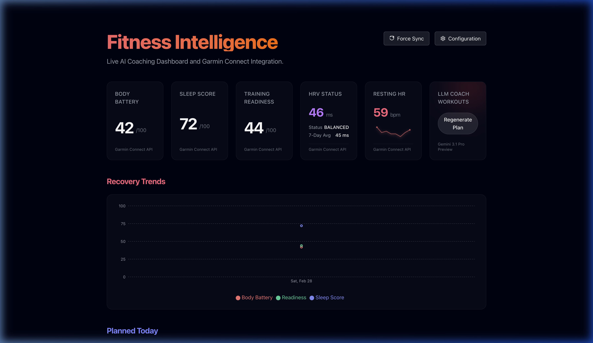
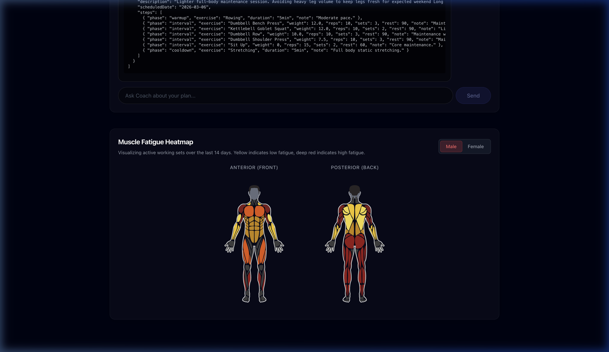

# Fitness Journal Coach

<div align="center">
  
  <br/>
  <em>Automated Walkthrough of the Live AI Coaching Dashboard</em>
  <br/><br/>
  
  <br/>
  <em>Live AI Coaching Dashboard with Garmin Hub Integration</em>
  <br/><br/>
  
</div>

> 🚨 **NOT A DEVELOPER?** Check out our **[Dummies Installation Guide](INSTALL_DUMMIES.md)** for a simple, step-by-step way to get set up without any coding knowledge!

This project is an automated fitness coaching assistant. It fetches health and activity data from Garmin Connect, sleep and body battery metrics, and syncs past workouts to a local database. Using a large language model (Gemini 3.1 Pro), it generates weekly workout schedules tailored to your goals and automatically uploads them back to your Garmin calendar.

You interact with the coach via a Signal Messenger bot.

## Prerequisites

To run this application, you will need:

- **Docker and Docker Compose** installed on your system.
- **A Signal Phone Number**: You must have a registered phone number to act as the bot. It does not need to be a mobile number; prepaid SIMs or landlines/VoIP numbers work via voice verification.
- **Garmin Connect Account**: Active Garmin credentials to fetch and push data.
- **Google Gemini API Key**: Used to generate the workout plans.

## Setup Instructions

### 1. Environment Configuration

Clone the repository and set up your core configuration files. The application uses `Fitness.toml` for configuration, supporting rich profile switching (e.g. `[default]`, `[dry_run]`).

1. Create a `Fitness.toml` file in the root directory:
   ```toml
   [default]
   # Security & API
   api_auth_token = "change_me_to_a_long_random_value"
   cors_allowed_origins = "http://localhost:3000"
   api_bind_addr = "127.0.0.1:3001"
   chat_rate_limit_per_minute = 30
   generate_rate_limit_per_hour = 6

   # AI Configuration
   gemini_api_key = "your_gemini_api_key"

   # Signal Bot
   signal_phone_number = "your_bot_phone_number"
   signal_subscribers = "your_subscriber_number"
   morning_message_time = "07:00"
   ```

   **Migrating from `.env`:**
   If you have an older `.env` file, you can automatically migrate by creating a `Fitness.toml` and transliterating your variables to lowercase under `[default]`. `Figment` will seamlessly absorb old `.env` files natively for fallback (unless it's a numeric string mapping issue), but `.toml` unlocks the true power of profiles allowing safe testing:
   ```toml
   [dry_run]
   database_url = "fitness_journal_dry_run.db"
   api_bind_addr = "127.0.0.1:3001"
   ```
   *(Note: `DASHBOARD_ADMIN_PASSWORD` can still be provided via `.env`)*

   **Note on Timezones:** By default, Docker containers run in UTC. If you want the `MORNING_MESSAGE_TIME` to trigger at your correct local time, you must add your timezone to the `fitness-coach` service in `docker-compose.yml`:
   ```yaml
   environment:
     - TZ=Europe/Zurich # Change to your local timezone
   ```

2. Log in to Garmin to generate your tokens:
   ```bash
   cargo run -- --login
   ```
   Follow the interactive prompts to enter your Garmin email, password, and MFA code (if applicable). This will securely authenticate via Garmin SSO and save the resulting OAuth tokens in `secrets/oauth1_token.json` and `secrets/oauth2_token.json`.

### 2. Setting Up the Signal Bot

The Signal API runs in its own container (`signal-cli-rest-api`). You must register your designated bot phone number with the Signal network before starting the main application.

```bash
# Start ONLY the Signal API container
docker-compose up -d signal-api
```

#### Registering via QR Code (Secondary Device Link)
The easiest way to register is to link the bot as a secondary device to an existing Signal account using a QR code.

Since the Signal API runs in `json-rpc` performance mode by default (which disables the QR code endpoint), we need to start it in `normal` mode temporarily:

1. Edit your `docker-compose.yml` and temporarily change `MODE=json-rpc` to `MODE=normal`:
   ```yaml
     signal-api:
       image: bbernhard/signal-cli-rest-api:latest
       environment:
         - MODE=normal # <-- Change this temporarily
   ```

2. Restart the API container:
   ```bash
   docker-compose up -d signal-api
   ```

3. Open your browser and navigate to:
   `http://127.0.0.1:8080/v1/qrcodelink?device_name=Fitness-Coach`

4. A QR code will be displayed. Open the Signal app on your phone, go to **Settings -> Linked Devices -> + (Add New Device)**, and scan the QR code on your screen.

5. **Important:** Once linked, change `MODE=normal` back to `MODE=json-rpc` in your `docker-compose.yml`!

### 3. Running the Complete Application

Once your Signal number is registered and verified, you can launch the complete stack.

```bash
docker-compose up -d --build
```

This will build the Rust binary and start the `fitness-coach` bot daemon alongside the `signal-api`.

## Release Checklist

Use this checklist to publish safely.

### 1. Prepare Environment

1. Copy `.env.example` to `.env`.
2. Copy `dashboard/.env.example` to `dashboard/.env`.
3. Set secure values:
   - `API_AUTH_TOKEN`: long random secret.
   - `FITNESS_API_TOKEN`: same value as `API_AUTH_TOKEN`.
   - `DASHBOARD_ADMIN_PASSWORD`: dedicated dashboard admin password (or rely on API token fallback).
   - `CORS_ALLOWED_ORIGINS`: only your real frontend origin(s).
   - `API_BIND_ADDR`: keep `127.0.0.1:3001` unless intentionally exposing behind a reverse proxy.
4. Confirm Garmin token files exist:
   - `secrets/oauth1_token.json`
   - `secrets/oauth2_token.json`

### 2. Run Preflight

```bash
./scripts/publish-preflight.sh
```

Required outcome: all checks pass.

### 3. Build and Launch

```bash
docker-compose up -d --build
```

After deployment:

1. Verify API health from a trusted host with token:
   - `curl -H "x-api-token: $API_AUTH_TOKEN" http://127.0.0.1:3001/api/progression`
2. Verify dashboard loads and data cards populate.
3. Trigger one generation and confirm only `FJ-AI:` workouts are created/deleted.

### 4. Security Validation

1. Confirm Signal REST API is localhost-only (`127.0.0.1:8080`).
2. Confirm `FITNESS_DEBUG_PROMPT` is not set in production.
3. Confirm secrets and DB files are not committed (`.env`, `secrets/*`, `*.db*`).
4. Confirm API rejects unauthenticated requests when `API_AUTH_TOKEN` is set.
5. Confirm `/settings` and `/api/profiles` require dashboard admin credentials.

### 5. Rollback Plan

1. Stop services:
   - `docker-compose down`
2. Re-deploy the previous known-good image/commit.
3. Restore previous `.env` and `secrets/` backup if needed.

## Usage

Send a message on Signal to the bot phone number you registered to interact with it.

- `/status` -> Returns your current Body Battery, Sleep Score, and today's planned workouts.
- `/generate` -> Triggers the LLM to analyze your recent health/activity data, generate a new plan, and upload it to your Garmin calendar.
- `/macros <kcal> <protein>` -> Logs your nutrition for the day to the local `fitness_journal.db`. (e.g., `/macros 2500 150`)

## Architecture

- **`src/*.rs`**: The main Rust application, API server, and Signal WebSocket listener. Garmin Connect logic (authentication, data fetching, and workout construction) is implemented entirely in native Rust. 
- **`dashboard/`**: A React-based frontend dashboard configured with Next.js and `react-body-highlighter` to visualize scheduled workouts and muscle fatigue.
- **`fitness_journal.db`**: Local SQLite database storing workout logs, exercise metadata, and max progression tracking.

## Running the Dashboard

The application also includes a local dashboard to view upcoming scheduled workouts and human body graphics showing muscle fatigue.

1. Start the Rust API backend:
   ```bash
   cargo run -- --api
   ```
   The dashboard can authenticate against the backend via:
   - `FITNESS_API_BASE_URL` (default: `http://127.0.0.1:3001`)
   - `FITNESS_API_TOKEN` (should match `API_AUTH_TOKEN` if auth is enabled)
   - `DASHBOARD_ADMIN_USERNAME` / `DASHBOARD_ADMIN_PASSWORD` for settings/profile editing routes

2. In a separate terminal, start the Next.js frontend:
   ```bash
   cd dashboard
   npm install   # Only needed once
   npm run dev
   ```
3. Open `http://localhost:3000` in your browser.
4. Open `/settings` and authenticate with dashboard admin credentials when prompted.

## Special Thanks

This project was built with reference to the following open-source projects:

- **[garminconnect](https://github.com/cyberjunky/python-garminconnect)** - Python Garmin Connect API wrapper which served as a valuable reference for the Garmin API endpoints.
- **[garth](https://github.com/matin/garth)** - Garmin SSO OAuth toolkit for Python, which heavily inspired our native Rust login implementation.
- **[signal-cli-rest-api](https://github.com/bbernhard/signal-cli-rest-api)** - Dockerized REST API wrapper around `signal-cli` that powers our bot's communication with the Signal network.
- **[react-body-highlighter](https://github.com/GV79/react-body-highlighter)** - React component used in the dashboard to visualize muscle fatigue on a human body graphic.

## Changelog

**Recent Features (Since `eda6f0f8d5dba6884c5784c94543d2325da0c3a1`)**
- **Configuration**
  - Implemented centralized configuration management using `figment` to load settings from a `Fitness.toml` file or environment variables, supporting `[dry_run]` profiles safely.
- **Bot & Conversational AI**
  - Conversational AI coach with live Garmin context, flexible workout scheduling, and chat history persistence.
  - Enhanced bot context with recent activities, aligned Garmin daemon frequency to 5 minutes, and included AI analysis summaries.
  - Implemented AI-powered automatic activity analysis and Signal broadcasts based on configured sports in user profiles.
  - Improved bot message parsing for sender/destination and enhanced "note to self" message detection via UUIDs.
  - Introduced daily morning workout briefings, post-generation workout summaries, and chat message timestamps.
- **AI Assessments & Dashboards**
  - Introduced AI-powered monthly debriefs and race readiness assessments with new bot commands and scheduled notifiers.
  - Weekly AI coach review notification and coach brief history in the dashboard UI.
  - Added recovery history chart to the dashboard, including new API endpoints and database storage for daily recovery metrics.
  - Refined workout type extraction logic, replaced body highlighter library with `@mjcdev/react-body-highlighter`, and added gender selection to the muscle map.
  - AI-powered workout duration prediction with API endpoints, database caching, and frontend UX enhancements.
- **Refactoring & Tech Debt Checkups**
  - Migrated CLI argument parsing to `clap` and replaced `println!` and `eprintln!` with `tracing` macros for structured logs.
  - Improved workout parsing synchronization and enhanced SQLite initialization robustness.
