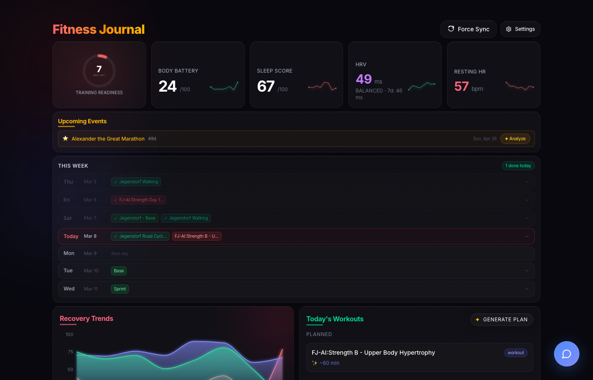
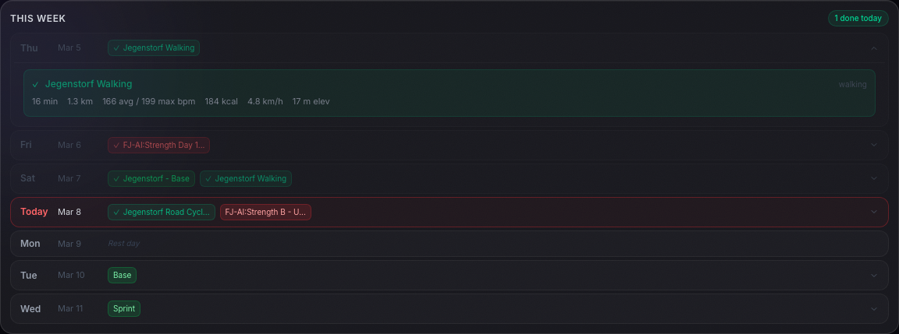
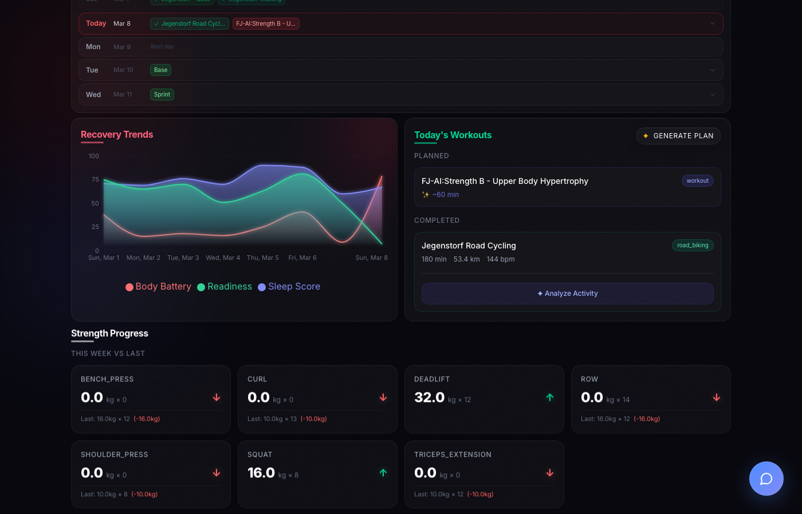
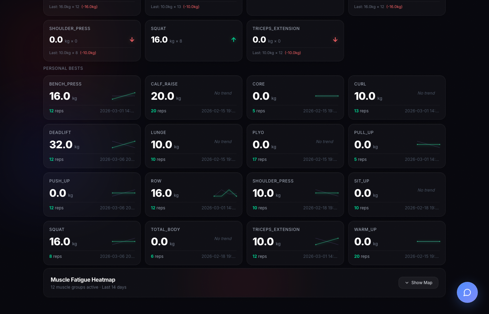
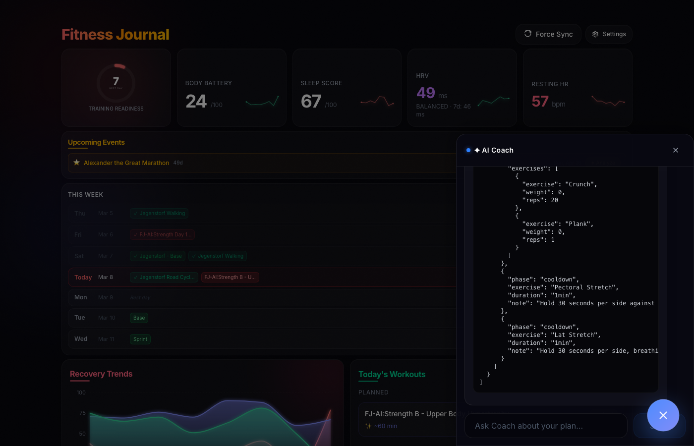

# Fitness Journal Coach

An automated AI fitness coaching ecosystem that connects **Garmin Connect**, **Google Gemini AI**, and **Signal Messenger** into a unified training platform. It fetches your health and activity data, generates personalized weekly workout plans, uploads them to your Garmin calendar, and communicates with you through a Signal bot and a real-time PWA dashboard.

---

## Dashboard

<div align="center">
  
  <br/>
  <em>The main dashboard showing training readiness, recovery metrics with sparkline trends, upcoming events, and the weekly calendar</em>
</div>

### Recovery Metrics & Readiness

The top row shows real-time Garmin recovery data, each with a 30-day sparkline trend:

- **Training Readiness** ring with color-coded score
- **Body Battery** with daily max tracking
- **Sleep Score** with daily max tracking
- **HRV** (Heart Rate Variability) with last-night and 7-day average
- **Resting Heart Rate** trend

All recovery metrics use the highest observed value per day, giving you an accurate daily trend rather than fluctuating intra-day readings.

### Weekly Calendar

<div align="center">
  
  <br/>
  <em>Expandable weekly calendar showing completed activities with stats and upcoming scheduled workouts with full details</em>
</div>

A 7-day view (3 past + today + 3 future) with expandable day rows. Click any day to see:

- **Completed activities** with duration, distance, pace/speed, heart rate, calories, elevation, and power
- **Scheduled workouts** with full exercise breakdowns:
  - Strength workouts: exercises, sets, reps, and weight targets
  - Running workouts: warmup, interval structures, pace zones, recovery periods
  - Garmin Coach adaptive workouts: fully expanded with nested repeat groups and pace targets
  - Run course creation directly from scheduled workouts

### Recovery Trends & Today's Workouts

<div align="center">
  
  <br/>
  <em>30-day recovery chart (body battery, readiness, sleep score) alongside today's planned and completed workouts</em>
</div>

- **Recovery Trends** chart powered by Recharts, showing body battery, training readiness, and sleep score over the last 30 days
- **Today's Workouts** panel with AI-predicted durations, generate button to trigger new plans, and per-activity AI analysis

### Strength Progression

<div align="center">
  
  <br/>
  <em>Week-over-week strength deltas, all-time personal bests with sparkline trends, and the muscle fatigue heatmap</em>
</div>

- **Week vs Last** comparison cards showing weight and rep changes per exercise
- **Personal Bests** grid with all-time records and sparkline trend lines
- **Muscle Fatigue Heatmap** visualizing 14-day training frequency on an interactive body diagram

### AI Coach Chat

<div align="center">
  
  <br/>
  <em>Conversational AI coach with full context of your training, recovery, and goals</em>
</div>

A floating chat panel connected to Google Gemini, enriched with your complete athlete context: current recovery metrics, recent activities, upcoming events, profile goals, and strength PRs. The AI can analyze your training and schedule workouts directly to your Garmin calendar from the conversation.

---

## Features

### Automated Coaching Pipeline
1. **Garmin data sync** every 5 minutes: activities, body battery, sleep, HRV, training readiness, RHR, scheduled workouts
2. **Recovery metrics** tracked in SQLite with daily max values
3. **Auto-analysis** of completed activities matching configured sport types, broadcast via Signal
4. **AI coach brief** built from all data + user profile goals + progression history + adherence tracking + coaching memory
5. **Workout generation** via Gemini AI, uploaded to Garmin calendar (prefixed `FJ-AI:` for lifecycle management)
6. **Strength validation** daily check that Garmin scheduled workouts match the AI-generated specs

### Signal Bot Commands
- `/status` - Current body battery, sleep score, and today's planned workouts
- `/generate` - Trigger full AI coach pipeline (analyze data, generate plan, upload to Garmin)
- `/macros <kcal> <protein>` - Log daily nutrition
- `/readiness` - AI race readiness assessment based on upcoming events and recent training
- **Free-text chat** - Any non-command message starts a conversational AI coaching session with full context

### Scheduled Notifications
All broadcast automatically to Signal subscribers:
- **Morning Briefing** - daily workout reminder at configured time
- **Weekly Review** - AI-generated volume and recovery analysis
- **Monthly Debrief** - month-over-month training comparison with peak weights
- **Race Readiness** - triggers at 14, 7, and 2 days before events with taper advice
- **Strength Validation** - daily workout spec integrity check
- **Auto Activity Analysis** - AI analysis of completed activities by sport type

### Dashboard (Next.js PWA)
- Real-time recovery metrics with 30-day sparkline trends
- Expandable weekly calendar with full workout details for completed and scheduled workouts
- Recovery trends chart (body battery, sleep score, training readiness)
- Strength progression with week-over-week deltas and all-time personal bests
- Muscle fatigue heatmap (14-day frequency on interactive body diagram)
- AI coaching chat with Garmin context injection
- AI-powered activity analysis and upcoming event assessment
- AI-predicted workout durations
- Profile/goals management (protected settings page)
- Garmin Coach adaptive workout details (warmup, intervals, pace zones, recovery)
- Run course creation from scheduled workouts

---

## Prerequisites

- **Docker and Docker Compose**
- **Signal Phone Number** for the bot (prepaid SIMs or VoIP numbers work via voice verification)
- **Garmin Connect Account** with active credentials
- **Google Gemini API Key** (for AI workout generation and chat)

## Setup Instructions

### 1. Configuration

Clone the repository and create a `Fitness.toml` in the root directory:

```toml
[default]
# Security & API
api_auth_token = "change_me_to_a_long_random_value"
cors_allowed_origins = "http://localhost:3000"
api_bind_addr = "127.0.0.1:3001"
chat_rate_limit_per_minute = 30
generate_rate_limit_per_hour = 6

# AI
gemini_api_key = "your_gemini_api_key"

# Signal Bot
signal_phone_number = "your_bot_phone_number"
signal_subscribers = "your_subscriber_number"
morning_message_time = "07:00"
```

Configuration is loaded via `figment`, merging `Fitness.toml` -> `Fitness.json` -> environment variables. Supports profile switching:

```toml
[dry_run]
database_url = "fitness_journal_dry_run.db"
api_bind_addr = "127.0.0.1:3001"
```

**Timezone:** Docker containers run in UTC by default. Add your timezone to the `fitness-coach` service in `docker-compose.yml`:
```yaml
environment:
  - TZ=Europe/Zurich
```

### 2. Garmin Login

Generate OAuth tokens by running the interactive login:

```bash
cargo run -- --login
```

Follow the prompts for email, password, and MFA code. Tokens are saved to `secrets/oauth1_token.json` and `secrets/oauth2_token.json`.

### 3. Signal Bot Setup

```bash
# Start Signal API container
docker-compose up -d signal-api
```

**Link as secondary device:**

1. Temporarily change `MODE=json-rpc` to `MODE=normal` in `docker-compose.yml`
2. Restart: `docker-compose up -d signal-api`
3. Open `http://127.0.0.1:8080/v1/qrcodelink?device_name=Fitness-Coach`
4. Scan QR code from Signal app: **Settings -> Linked Devices -> Add New Device**
5. Change `MODE` back to `json-rpc`

### 4. Launch

```bash
docker-compose up -d --build
```

This starts all four services:

| Service | Container | Purpose |
|---------|-----------|---------|
| `signal-api` | `fitness-coach-signal-api` | Signal network bridge (JSON-RPC mode) |
| `fitness-coach` | `fitness-coach` | Signal bot + daemon (5-min Garmin sync cycle) |
| `fitness-api` | `fitness-api` | REST API server (port 3001) |
| `fitness-web` | `fitness-web` | Next.js dashboard (port 3000) |

### 5. Local Development

```bash
# Rust backend
cargo run -- --api             # Start API server
cargo run -- --signal --daemon # Start Signal bot + daemon
cargo fmt --all -- --check     # Format check
cargo clippy --all-targets --all-features -- -D warnings  # Lint
cargo test --all-targets       # Tests

# Next.js dashboard
cd dashboard
npm install
npm run dev                    # Dev server at localhost:3000
npm run build                  # Production build
npm run lint                   # ESLint
```

---

## Architecture

### Rust Backend (`src/`)

Single binary with multiple runtime modes via CLI flags (`clap`):

| Flag | Mode |
|------|------|
| `--api` | Axum REST API server |
| `--signal` | Signal bot WebSocket listener |
| `--daemon` | Background loop (5-min cycle): Garmin fetch, sync, AI analysis/generation |
| `--login` | Interactive Garmin OAuth flow with MFA |
| `--delete-workouts` | Bulk delete `FJ-AI:` prefixed workouts from Garmin |

Key modules: `config.rs` (figment config), `garmin_api.rs` (native Rust Garmin Connect API with OAuth1/OAuth2), `garmin_client.rs` (high-level client with caching), `ai_client.rs` (Gemini API), `coaching.rs` (brief builder), `bot.rs` (Signal bot + scheduled notifiers), `workout_builder.rs` (AI JSON to Garmin workout payloads with fuzzy exercise matching), `api.rs` (Axum REST API with rate limiting), `db.rs` (SQLite via rusqlite).

### Next.js Dashboard (`dashboard/`)

Next.js 16 with App Router, React 19, Tailwind CSS 4, TypeScript. Server-side rendered with a catch-all API proxy forwarding to the Rust backend. Protected settings page with Basic Auth.

### Data Flow

```
Garmin Connect  -->  Rust Daemon (5-min sync)  -->  SQLite
                          |                           |
                     Gemini AI  <--  Coach Brief  <---+
                          |
                     Garmin Calendar  (FJ-AI: workouts)
                          |
                     Signal Bot  -->  Subscribers
                          |
                     Dashboard  <--  REST API  <--  SQLite
```

---

## API Endpoints

| Method | Path | Description |
|--------|------|-------------|
| GET | `/api/progression` | Exercise progression history with trend points |
| GET | `/api/progression/deltas` | Week-over-week weight/rep comparisons |
| GET | `/api/recovery` | Current recovery metrics |
| GET | `/api/recovery/history` | 30-day recovery history |
| GET | `/api/workouts/today` | Today's completed and planned workouts |
| GET | `/api/workouts/upcoming` | Future scheduled workouts with full details |
| GET | `/api/activities/week` | Past 7 days of activities |
| POST | `/api/force-pull` | Clear cache, force fresh Garmin data fetch |
| POST | `/api/generate` | Trigger full AI coach pipeline (rate limited) |
| POST | `/api/predict_duration` | AI-predicted workout duration (cached) |
| POST | `/api/analyze` | AI analysis of a completed activity (cached) |
| POST | `/api/analyze/upcoming` | AI analysis of an upcoming event |
| POST | `/api/course/create` | Create a Garmin run course from a workout |
| GET | `/api/chat` | Retrieve coach brief history |
| POST | `/api/chat` | Send message to AI coach (rate limited) |
| GET | `/api/muscle_heatmap` | 14-day muscle group frequency heatmap |
| GET/PUT | `/api/profiles` | Read/update athlete profiles |

All endpoints require `x-api-token` header or Bearer auth when `api_auth_token` is configured.

---

## Special Thanks

- **[garminconnect](https://github.com/cyberjunky/python-garminconnect)** - Python Garmin Connect API reference for endpoint discovery
- **[garth](https://github.com/matin/garth)** - Garmin SSO OAuth toolkit that inspired the native Rust login implementation
- **[signal-cli-rest-api](https://github.com/bbernhard/signal-cli-rest-api)** - Dockerized Signal CLI REST API powering the bot
- **[react-body-highlighter](https://github.com/GV79/react-body-highlighter)** - React component for the muscle fatigue heatmap visualization
